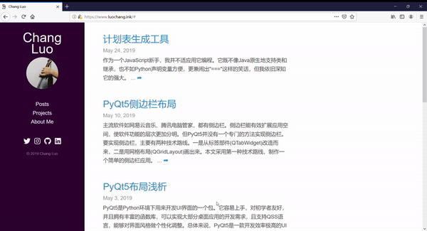

# sidenav 

A hidden sidebar plug-in. Allow you to store your favourite website on it as an iframe. Moreover, this plug-in improves network performance. Even if many iframes are loaded, it won't affect the load speed of your websites.

[中文](https://github.com/luochang212/sidenav/blob/master/README_zh.md)

## Example

- [Demo](https://luochang212.github.io/demo/sidenav/)

## Feature

- Even if many iframes are loaded, it won't affect the load speed of your websites.

- The music player will still work after closing the sidebar navigation.

## Usage

Replace `&#9776; open` below with the element of your website.

```html
<a href="#" class="load-iframe" onclick="openNav()" style="font-size:30px;cursor:pointer">&#9776; open</a>
```

## Presentation

